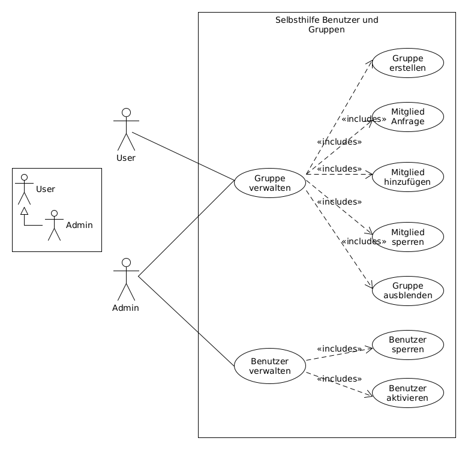

# Konzept und Realisierung

Die meisten Projekte beginnen für Gewöhnlich damit, dass als erstes ein (technisches) Konzept erstellt wird und ausgehend davon dann die Entwicklung bzw. Realisierung startet. Wenn ich selbst in einem Team arbeite, dann ist das auch bei mir ziemlich selbstverständlich so vorzugehen. Arbeite ich jedoch alleine, findet die Konzeption meistens nur im Kopf statt. Doch den Kopf der Entwickler lässt sich schwer reinschauen, weshalb ich zumindest einen kleinen Anwendungsfalldiagramm angefertigt habe, der zeigen soll, wohin die Reise hier eigentlich im Groben gehen soll.

## Skizzierung weiterer Schritte

Die einzelnen Punkte innerhalb des Anwendungsfalldiagramms werden nun einzeln erläutert. Die Use Cases beim Benutzermanagement, wo die Rolle User und Admin existieren und wo nur der Admin die Benutzer freigeben und sperren kann, sind bereits umgesetzt. Diese Schritte werden trotzdem noch einmal vollständigkeitshalber erläutert:

### Use Cases im Detail

| Use Case | Beschreibung |
| :---: | --- |
| ** Benutzerrollen ** | Aktuell haben wir nur zwei Benutzerrollen. Alle registrierten Benutzer erhalten die Rolle User und nur der Seitenbetreiber erhält zusätzlich die Rolle Admin. Die Admin Rolle darf damit alle Aktionen durchführen, die auf der Plattform möglich sind. Die Benutzer können von Außen nicht sehen, welcher Benutzer eine Admin Rolle hat. |
| ** Benutzer verwalten ** | Nur die Rolle Admin darf alle Benutzer innerhalb der Plattform sehen und verwalten. |
| Benutzer sperren | Sollte ein Nutzer (nur User Rolle) z.B. gegen Nutzerrichtlinien verstoßen, kann ein Admin den Nutzer sperren. Ein gesperrte Nutzer kann sich anschließend nicht mehr einloggen, neu registrieren und die Plattform nutzen. |
| Benutzer aktivieren | Nutzer, die z.B. gesperrt worden sind, lassen sich vom Admin wieder reaktivieren. |
| Benutzer verwalten | Nur die Rolle Admin darf alle Benutzer innerhalb der Plattform sehen und verwalten. |
| ** Gruppe verwalten ** | Alle Nutzer mit der Rolle User dürfen ihre eigenen Gruppen verwalten. Eine Gruppe sollte als Selbsthilfegruppe verstanden werden. Eine Gruppe gehört immer nur dem Nutzer, der diese erzeugt hat. Nur der Admin Nutzer darf auch fremde Gruppen mit verwalten. Allerdings darf ein Admin Nutzer nur innerhalb der Gruppe mit kommunizieren, wenn auch der Admin Mitglied der Gruppe ist. |
| Gruppe erstellen | Jeder Nutzer mit der Rolle User darf beliebig viele Gruppen anlegen. Die Gruppe erhällt einen Namen und eine Beschreibung, damit andere Nutzer diese Gruppe besser zuordnent können. Eine Gruppe erhält damit einen Verweis auf den Erzeuger. ||| Gruppe ausblenden  | Sollte eine Gruppe außer dem Erzeuger noch keine Mitglieder haben, kann diese Gruppe direkt gelöscht werden. Hat die Gruppe dagegen ein weiteren Mitglied, kann diese Gruppe nur noch ausgeblendet werden. Dadurch soll sichergestellt sein, dass keine Kommunikationsdaten vollständig gelöscht werden. |
| Mitglied Anfrage  | Alle Nutzer dürfen sehen, welche Gruppen vorhanden sind. Entscheidet sich ein Nutzer einer Gruppe beizutreten, kann dieser Nutzer eine Anfrage an den Erzeuger der Gruppe starten. Der Erzeuger der Gruppe sieht eine Auflistung aller Anfragen und kann entweder die Anfrage akzeptieren oder verweigern. Eine Anfrage kann auch durch den Anfrage-Steller wieder zurückgezogen werden. |
| Mitglied hinzufügen  | Nutzer werden erst zum Mitglied einer Gruppe, wenn der Erzeuger der Gruppe den Nutzer zum Mitglied der Gruppe gemacht hat. Nur der Erzeuger der Gruppe darf Mitglieder in die Gruppe hinzufügen. Auch der Admin Nutzer darf keine Mitglieder in eine fremde Gruppe hinzufügen. |
| Mitglied sperren  | Sowohl der Erzeuger, als auch der Admin dürfen Mitglieder sperren.  Die Sperre erfolgt jedoch beim Erzeuger anderes als beim Admin. Der erzeuger sperrt das Mitglied nur aus der Gruppe und der Admin vollständig aus der Plattform durch die oben genannte Benutzer Verwaltung. Sollte der Admin den Erzeuger der Gruppe sperren, so werden auch automatisch alle Gruppen des Erzeugers mit gesperrt bzw. ausgeblendet. |

### Fazit zu den User Cases

Mithilfe der Skizze haben wir schon ein grobes Bild, wie die gesammte Plattform funktionieren soll. Jeder einzelne Use Case verantschaulicht bereits mehrere Abhänigkeiten untereinander. Wie vielleicht schon bemerkt, wirkt die Plattform sehr abstrakt. Die Absicht darunter ist, dass die Plattform zunächst komplett unabhängig vom jeweiligen Thema bleiben soll. Möchte der Betreiber später zum Beispiel das Hauptthema ** Angst ** wählen, so kann das Layout hier entsprechend visualisiert werden. Sollten es jedoch mehrere Themen sein, dann sollte das auch kein Problem sein, wenn die Übersichtlichkeit hier keine große Rolle spielt.

Ansonsten soll die Möglichkeit hier eine eigene Plattform aufzusetzen als eine neue weitere Ergänzung für Selbsthilfe-Netzwerk.de und Anonym-Chat.de dienen. Die Plattform soll später wie ein Forum funktionieren (Selbsthilfe-Netzwerk). Allerdings werden die einzelnen Gruppen privat geführt und Niemand außer der Mitglieder und des Admins dürfen bei der Kommunikation mitlesen. Das der Admin die Gespräche mitlesen darf, hängt zum einem an der technischen Umsetzung (Daten im Klartext in Datenbank gespeichert und damit ohnehin lesbar für den Admin) und zum anderen hat sich der Admin an gewisse Richtlinien zu halten, die beim Betrieb einer Plattform anfallen. Zum Beispiel müssen die Inhalte frei von Beleidigungen, kriminellen Handlungen oder andere Verstößen sein. Diese Verantwortung muss beim Betrieb einer solchen öffentlichen Presenz immer mit eingerechnet werden.

