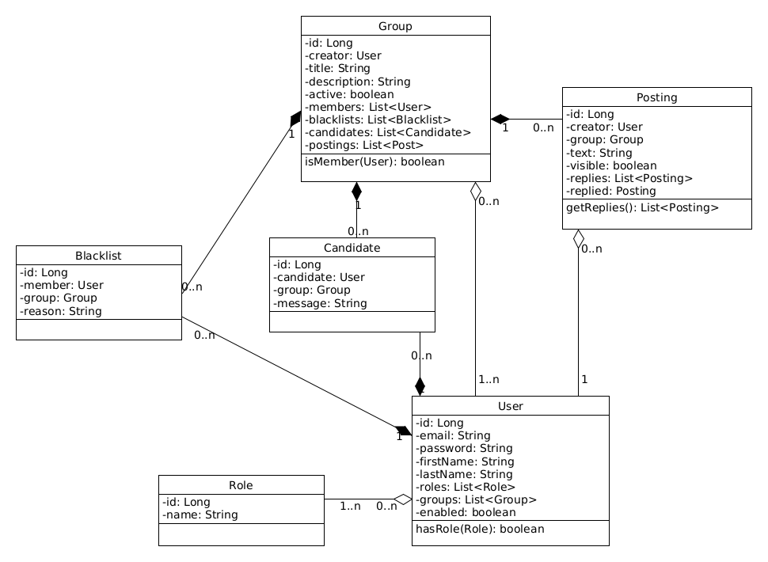

# Implementierung eines Feinkonzepts

In der erweiterten Konzeptphase sollten wir zunächst alle Hauptobjekte und deren Eigenschaften skizzieren. Diese frühe Phase erlaubt uns schon ein abstraktes Bild darüber zu machen, welche Daten und ihre Abhängigkeiten für uns zur Verfügung gestellt werden. Dafür eigen sich Klassendigramme sehr gut. Ausgehend von der Konzeptdarstellung werden danach die einzelnen Klassen implementiert. Damit hätten wir dann unseren Backend Bereich zum Großteil abgedeckt. Anschließend kümmern wir um unseren Frontend Bereich. Hier wollten wir eine Art geschlossenes Forum realisieren. Die HTML und CSS Bestandteile geben uns dann einen möglichen Orientierungspunkt. Hier handelt es sich um einen statischen Prototyp, den wir in der nächsten Aufgabe mit Leben füllen werden.

## Feinkonzept durch Klassendiagramm

Ausgehend von unserem letzten Anwendungsfalldiagramm erstellen wir im Feinkonzept einen Klassendiagramm. In diesem Diagramm fügen wir alle Enitäten ein, die wir bei unserer JPA Struktur verwenden. User und Role Entitäten existieren bereits aus den Vorversionen. Alle neuen Entitäten erhalten nur die Eigenschaften, die wir als absolut notwendig sehen. Später können wir diese Entitäten erweitern oder ergänzen. 

### Implementierung fehlender Entitäten

Die neuen Entitäten und Ihre Beziehungen sollen die folgenden Funktionen erfüllen:

| Entität | Funktion |
| :---: | --- |
| ** Group ** | Dabei handelt es sich um die Beschreibung einer neuen Selbsthilfegruppe. Ein Benutzer kann mehrere solcher Gruppen erzeugen und die Gruppe kann mehrere Mitglieder haben. Eine Gruppe kann auch entweder vom Erzeuger als auch vom Admin deaktiviert werden und ist anschließend für andere Mitglieder nicht mehr betretbar. Eine Gruppe representiert auch das Forum und sammelt damit alle Postings der Mitglieder. |
| ** Posting ** | Alle Postings sollen innerhalb einer Gruppe gespeichert. Postings, die nicht den Richtlinien entsprechen, können vom Erzeuger oder Admin ausgeblendet werden und sind dadurch für andere Mitglieder nicht mehr sichtbar. Ein Posting kann sowohl als Beitrag als auch als Antwort zum Beitrag verstanden werden. deshalb kann ein Posting auf mehrere andere Antwort-Beiträge verweisen. Eine Antwort hat damit immer einen Verweis auf einen Ursprungs-Beitrag. Ein Posting hat außerdem immer einen Erzeuger, der auch als einziger das Posting ändern oder löchen können soll. Da Änderungen von Postings noch viele weitere Schritte nötig machen, wie zum Beispiel historische Referenzen, werden diese Funktionen zunächst nicht weiter verfolgt. |
| ** Candidate ** | Alle angemeldeten Nutzer können nicht direkt in eine Gruppe eintreten. Dazu müssen Nutzer erst eine Anfrage an den Erzeuger einer Gruppe stellen. Erst wenn der Erzeuger den Nutzer in die Gruppe hinzufügt, kann dieser Nutzer in die Gruppe eintreten und darin Postings hinterlassen. Der Nutzer kann an den Erzeuger eine Nachricht schreiben und damit den Wunsch zu der Mitgliedschaft genauer erläutern. |
| ** Blacklist ** | Mitglieder einer Gruppe können vom Erzeuger oder Admin gesperrt werden. Damit wird die Mitgliedschaft auf unbestimmte Zeit aufgehoben. Der Grund für die Verbannung kann ebenfalls hinzugefügt werden. |

### UI / UX Darstellung

Zum besseren Verständnis und als Vorlage wird ein verantschaulichter Gruppen-Kontakt als HTML und CSS umgesetzt. Die Umsetzung der dynamische UI wird in der kommenden Aufgabe angegangen. 

