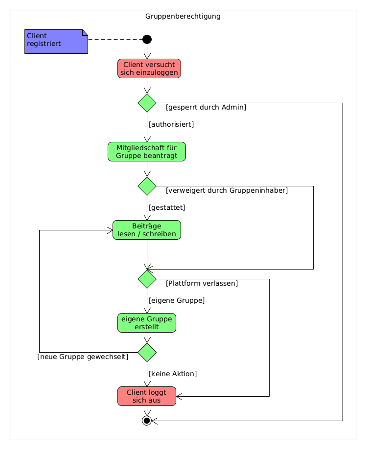

# Layoutanpassung, Rechtliches und Gruppenauthorisierungen

Wie bereits in der letzten Aufgabe angedeutet, ist bei der heutigen Aufgabe das Layout angepasst worden. Dazu haben wir das Template-Verfahren von Thymeleaf verwendet, wodurch wir auf jeder Seite nun ein statisches Menü und Footer erhalten. Dadurch hat nun jede Seite eine einheitlichere Struktur. Das wiederum ermöglicht uns das Impressum und die Datenschutzerklärung aus jeder Seite heraus mit einem Klick zu erreichen. Diese zwei rechtlich vorgeschriebenen Seiten haben wir als eine Vorlage hinzugefügt. Vor der Veröffentlichung der Plattform sollten Sie die Informationen hier mit Ihren Daten ergänzen. Die Notwendigkeit ein Impressum und eine Datenschutzerklärung bereits in dieser Phase der Entwicklung einzuführen, besteht darin, dass in der aktuellen Version auch persönliche Daten von den Nutzern erfasst werden können. Dadurch verpflichten Sie sich für Schutz und Transparenz zu sorgen, was Sie gegenüber den Nutzern der Plattform zu verantworten haben. Mehr zu den Regeln und Pflichten beim Betrieb einer Online-Plattform können Sie im Internet in den Rubriken DSGVO, BSI und Gesetze und Verordnungen im Internet nachlesen.

## Feinkonzept durch Aktivitätsdiagramm

Außerdem haben wir in der aktuellen Version ein weiteres Feinkonzept durch ein Aktivitätsdiagramm erstellt und damit begonnen dieses zu implementieren. Die Gruppen können bereits erstellt und eine Beitrittsanfrage gestellt werden. Anschließend erhällt der Erzeuger der Gruppe eine E-Mail mit der Information, wieviele Anfragen bearbeitet werden sollen. Der Gruppen-Ersteller kann die Anfrage entweder akzeptieren oder ablehnen. 

Beim nächsten Release möchten wir uns an die Erstellung von Beiträgen ransetzen. Danach müssen die neuen Services noch durch UnitTests auf Plasibilität geprüft werden.
