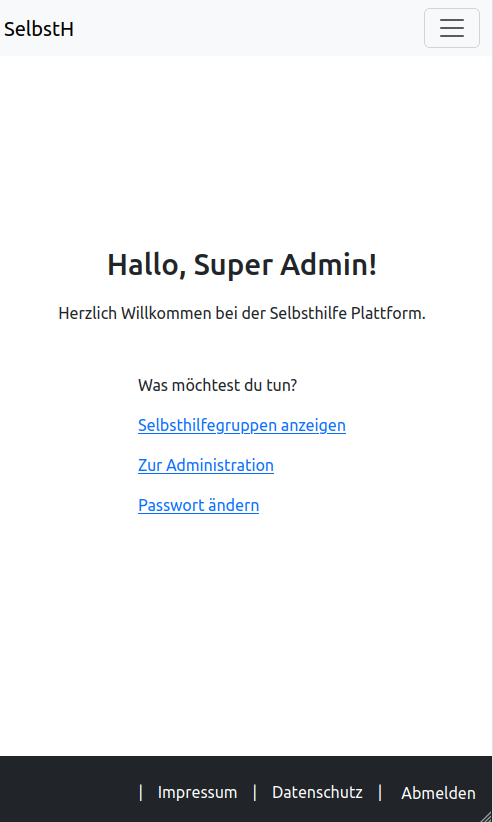
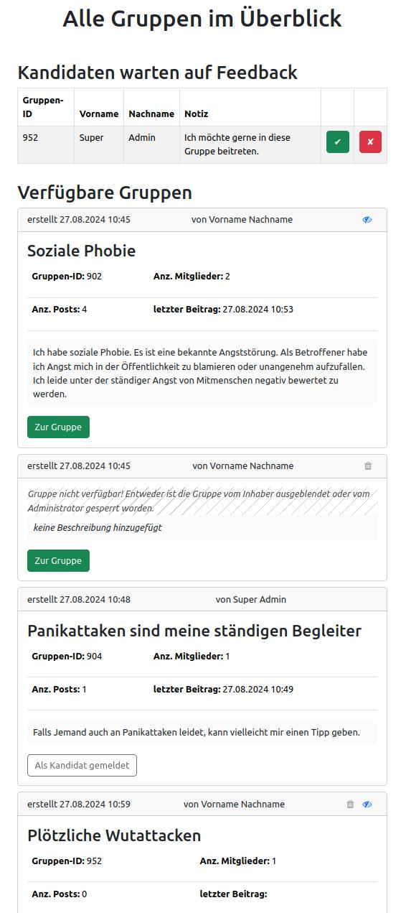
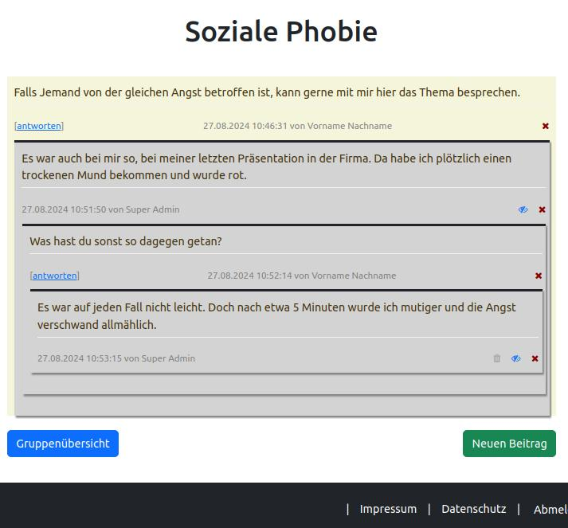
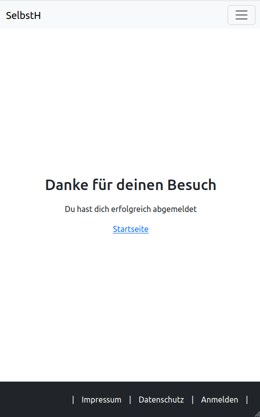

# Beta Status

Endlich können wir eine Version präsentieren, mit der bereits eine aktive Nutzung der Plattform möglich ist. Abzüglich von kleinen Verzögerungen hat die Umsetzung insgesamt etwa 3 Wochen gedauert. Aus Erfahrung kann ich sagen, dass die Umsetzung viel komplexerer Plattformen in der Regel deutlich länger dauert. Auch bei diesem Projekt lässt sich noch deutlich mehr machen. Zum Beipsiel können wir Beiträge in der aktuellen Version nicht editieren. Von dieser Funktion haben wir jedoch vorerst abgesehen, da es hierzu mehr gehört als nur den Text zu verändern. Denn wie bei jeder Plattform, die auf Kommunikation aufsetzt, muss man neben den "Look and Feel" Aspekten auch auf die nötige Navollziebarkeit der Inhalte Acht geben. Bei der Textveränderung könnte nähmlich ein Post erst die eine Information enthalten und sobald auf diese geantwortet wird, kann diese Information durch Änderung komplett den Kontext des Gesprächs verändern. Irritationen sind dann vorprogrammiert. Deshalb sollte man hier eine historisch nachvollziebare Speicherung möglich machen und eine Änderung entsprechend für alle sichtbar machen. Auch der Admin müsste hier reagieren können, falls es zu irgendwelchen Verstößen kommt. 

Die aktuelle Version möchten wir nun erstmal so belassen wie sie ist. Sollte bei Irgendjemandem Interesse bestehen, dass ich dieses Projekt weiter fortsetzen soll, kann mir gerne unter https://anonym-chat.de oder https://selbsthilfe-netzwerk.de schreiben. Wenn mir die Zeit es dann erlaubt hier weiter zu machen, dann werde ich das auch sehr gerne tun. Schließlich habe ich auch Anonym-Chat und Selbsthilfe-Netzwerk nicht über Nacht aufgebaut. Gerne kann dann auch aus den früheren Erfahrungen sehr viele Funktionen hier mit einfließen lassen. 

Last but not least: 

## Beispiel

Die ganze Zeit gab es keine Screenshots von der finalen Ansicht. Deshalb möchte ich diese hier gerne noch mal kurz hier nachreichen.

### Startseite




### Darstellung von Gruppen




### Darstellung von Beiträgen




### Auf Wiedersehen




## Achtung

Wenn Ihr die Einstellung bei Docker Compose den folgenden Parameter unverändert lässt...

```
"spring.jpa.hibernate.ddl-auto" : "create"
```

... dann riskiert Ihr, dass alle Daten die in der Datenbank bereits geschrieben sind, beim Host-Neustart gelöscht werden. Setzt daher diesen Parameter beim zweiten Start am besten auf "update". Der "create" Wert hat uns nur darin geholfen, dass die Datenbank immer auf einem sauberen Schema aufgesetzt worden ist und wir damit keine Anomalien z.B. durch überflüssige Tabellenspalten erhalten haben.